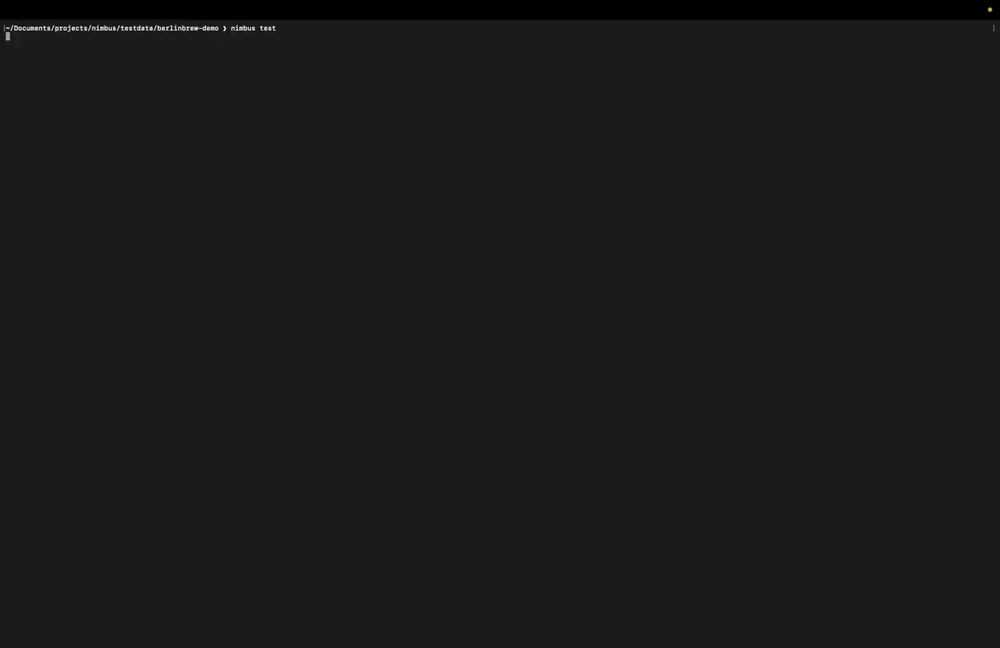
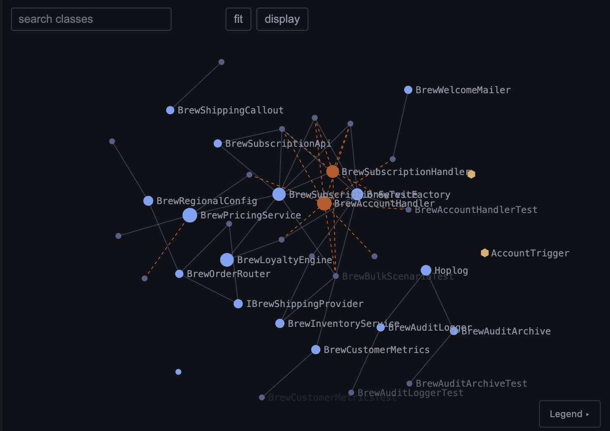

# Nimbus — the Salesforce dev toolchain, built on a local Apex runtime

**Run, test, debug, and ship Salesforce Apex locally. No org. No Docker. No JVM.**



At its core, Nimbus is a **local Apex runtime**: it executes Apex classes,
triggers, Flows, SOQL, and DML on your machine — against a real embedded
PostgreSQL database — so you can **run Apex tests locally without a Salesforce
org**. A typical test finishes in milliseconds, which makes Apex fast enough for
tight TDD loops, agent-driven development, and CI that doesn't depend on a
scratch org pool.

Around that runtime has grown the rest of the toolchain: a Language Server and
live debugger, an interactive dependency graph of your whole codebase, mutation
testing, execution traces, and a release surface that validates and deploys the
same code it just proved — all from one binary.

🌐 **[testnimbus.dev](https://testnimbus.dev)** &nbsp;·&nbsp;
📖 **[Docs](https://testnimbus.dev/docs)** &nbsp;·&nbsp;
🚀 **[Quickstart](https://testnimbus.dev/quickstart)** &nbsp;·&nbsp;
💬 **[Slack](https://join.slack.com/t/nimbuslocalap-tj23081/shared_invite/zt-3x7fxoo38-AAgO9QHP7if53JPunBxOPQ)**

---

## Why Nimbus

The Salesforce inner dev loop runs through an org. You change one line, push to a
scratch org or sandbox, wait minutes, and run your tests over the wire. Nimbus
removes the org from that loop:

- ⚡ **Tests in milliseconds**, not minutes — no deploy, no round-trip.
- 🗄️ **Real execution, not mocks** — SOQL runs as SQL against embedded
  PostgreSQL, DML persists, triggers fire, Flows execute.
- 🔌 **No org, no credentials, no Docker, no JVM** — a single binary, point it at
  your existing SFDX project and run. Works offline.
- 🕸️ **Your codebase as a graph** — `nimbus graph` maps classes, triggers,
  Flows, SObjects, custom metadata, and labels into a dependency graph — in the
  terminal, or the interactive viewer in the Dev UI, VS Code, and JetBrains.
  It includes the edges no static analyzer sees: DML on an object reaching its
  triggers and record-triggered Flows.
- 🚢 **Ship what you proved** — `nimbus deploy` runs your local gates, validates
  the same bytes against Salesforce, then deploys. `nimbus release` adds signed
  receipts, recorded quality gates, promote & rollback.
- 🤖 **Built for AI agents** — `nimbus mcp` exposes the test runner over MCP so
  Claude Code, Cursor, and Copilot can iterate in write-test-fix loops.
- 🧪 **Mutation testing** for Apex — verify your tests actually catch bugs.
- 🧰 **CI-native** — JUnit and Cobertura XML drop straight into GitHub Actions,
  GitLab CI, SonarQube, and Codecov.

## Install

**macOS / Linux**

```bash
curl -fsSL https://install.testnimbus.dev | sh
```

**Homebrew**

```bash
brew install nimbus-solution/nimbus/nimbus
```

**Windows (PowerShell)**

```powershell
irm https://testnimbus.dev/install.ps1 | iex
```

**Scoop**

```powershell
scoop bucket add nimbus https://github.com/nimbus-solution/scoop-nimbus
scoop install nimbus
```

**Salesforce CLI plugin**

```bash
sf plugins install @nimbus-solution/nimbus-sf-plugin
sf nimbus login
sf nimbus test "*"
```

The plugin source lives in [`sf-plugin/`](sf-plugin/). It installs the native
Nimbus runtime automatically, verifies the release checksum, and shares the
same Nimbus Pro login as the standalone CLI.

## Quickstart

From the root of your SFDX project:

```bash
# Run every test
nimbus test "*"

# Run a class or method pattern
nimbus test "AccountServiceTest.*"

# With coverage (Cobertura XML) + JUnit XML test results for CI
nimbus test "*" --coverage-report coverage.xml --results-xml results.xml

# What can a change to this class reach? The dependency graph, from the CLI
nimbus graph AccountService

# Local gates → Salesforce validation → deploy, in one command
nimbus deploy --target-org staging
```

A ready-to-copy GitHub Actions workflow lives in
[`examples/`](examples/) — see also the [CI/CD guide](https://testnimbus.dev/ci).

Nimbus reads your `sfdx-project.json`, finds your classes, triggers, and Flows,
and runs your real `@isTest` classes — the same ones that run on the platform.
No copying, no parallel project, no rewriting tests.

No project at hand? Clone
**[berlinbrew-demo](https://github.com/nimbus-solution/berlinbrew-demo)** — a
real-shape Salesforce DX project built to showcase Nimbus — and run
`nimbus test` in it.

Full guide: **[testnimbus.dev/quickstart](https://testnimbus.dev/quickstart)**

## The toolchain

Everything below ships in the same binary you just installed.

### Real Apex runtime

`nimbus test` · `nimbus exec` — classes, triggers, SOQL, and DML execute
against an embedded PostgreSQL, with parallel execution. `nimbus exec` is
Execute Anonymous, locally.
**[Why an embedded database →](https://testnimbus.dev/why-postgres)**

### Flow testing

Record-triggered, autolaunched, and platform-event Flows (and their subflows)
run alongside your Apex — same DML, same test.
**[Flow testing →](https://testnimbus.dev/flows)**

### Code coverage

Line, method, and branch coverage on every run — console, HTML, JSON, and
Cobertura output. `nimbus coverage diff` compares two runs for PR gates: the
delta, per-file regressions, the exact lines that lost coverage.
**[Coverage →](https://testnimbus.dev/coverage)**

### Watch mode

`nimbus test:watch` — save a class and the impacted tests re-run in
milliseconds. Dependency-tracked, so only the tests that need to run do. (Pro)
**[Watch mode →](https://testnimbus.dev/watch)**

### Mutation testing for Apex

`nimbus mutate` — flips operators, negates conditions, changes returns, and
checks your tests notice. Coverage tells you code ran; this tells you it's
tested. (Pro)
**[Mutation testing →](https://testnimbus.dev/mutation)**

### Test data factories

`nimbus fixture` — generates a TestDataFactory from your actual schema: a
`create` method per SObject, required fields populated, required lookups wired
parents-first.
**[Test data →](https://testnimbus.dev/fixture)**

### HTTP callout mocking

Declarative mock responses for callout tests and anonymous execution — URL
pattern matching (Pro), no code changes to your classes.
**[HTTP mocking →](https://testnimbus.dev/docs#http-mock-tests)**

### Governor limits

SOQL, DML, CPU, and heap limits enforced locally — and configurable, so limit
bugs surface on your machine instead of in the org.
**[Governor limits →](https://testnimbus.dev/governor-limits)**

### Managed packages

Run tests that touch managed-package classes: namespace handling, symbol
resolution, stub scaffolding and auto-generation (Pro).
**[Managed packages →](https://testnimbus.dev/managed-packages)**

### Failure intelligence

`nimbus explain` · `nimbus triage` · `nimbus history` — the full account of a
failure (exception, source location, expected vs. actual, the SOQL and DML
just before), failures grouped by cause, and every past run browsable in a TUI.
**[Failure intelligence →](https://testnimbus.dev/explain)**

### Live Apex debugger

`nimbus dap` — breakpoints, stepping, and variable inspection over DAP. Live
execution, not log replay. (Pro)
**[Debugger →](https://testnimbus.dev/debugger)**

### Execution traces & analytics

Every test run produces a structured OpenTelemetry trace — method calls, SOQL,
DML, triggers, branches — explorable as a tree, not a 40,000-line debug log. (Pro)
**[Traces & analytics →](https://testnimbus.dev/analytics)**

### Benchmarking

`nimbus bench` — run a test method N times and get mean, median, p95, p99, and
governor-limit headroom. Treat Apex performance like any other language. (Pro)
**[Bench →](https://testnimbus.dev/bench)**

### Apex dependency graph

`nimbus graph` — classes, triggers, Flows, SObjects, custom metadata, and
labels as one graph, including DML-to-trigger and DML-to-Flow edges no static
analyzer sees. Interactive viewer in the Dev UI, VS Code, and JetBrains.
**[Dependency graph →](https://testnimbus.dev/graph)**



<p align="center"><sub>The dependency graph of <a href="https://github.com/nimbus-solution/berlinbrew-demo">berlinbrew-demo</a> in the interactive viewer — highlighted, what a change to the selected class can reach.</sub></p>

### Browser Dev UI

`nimbus dev` — test explorer, coverage, schema browser, and an Apex REPL in
your browser. No editor needed. (`nimbus schema` opens the schema explorer
directly.)
**[Dev UI →](https://testnimbus.dev/dev-ui)**

### Apex Language Server

`nimbus lsp` — code lenses, inlay hints, semantic tokens, and call hierarchy in
any LSP editor: VS Code, Cursor, Neovim, Zed, JetBrains, Helix, Emacs.
**[Language Server →](https://testnimbus.dev/lsp)**

### Local app hosting

`nimbus app` — a local development server for Salesforce Multi-Framework UI
bundles, running your app against the local runtime and database. A drop-in
replacement for `sf ui-bundle dev` that works offline. (Pro)
**[App hosting →](https://testnimbus.dev/app)**

### Gated deploys & assured releases

`nimbus deploy` — local gates, Salesforce validation of the same bytes, then
deploy, in one command. `nimbus release` adds signed receipts, recorded quality
gates, promote & rollback (Pro). The self-hosted **Assurance console** serves
the whole audit trail — receipts, gate results, deployment history — to your
team. `nimbus sf` passes any Salesforce CLI command through untouched.
**[Deploy & release →](https://testnimbus.dev/deploy)** ·
**[Assurance →](https://testnimbus.dev/assurance)**

### MCP server for AI agents

`nimbus mcp` — Claude Code, Cursor, and Copilot call the runtime natively for
tight write-test-fix loops, with curated agent skills via `nimbus skills`. It
also tests Headless 360 tool surfaces — `@InvocableMethod`, `@AuraEnabled`,
`@RestResource` — locally.
**[Agentic development →](https://testnimbus.dev/agentic)** ·
**[Headless 360 →](https://testnimbus.dev/headless360)**

### Local Salesforce API

`nimbus serve` — a Salesforce-compatible REST and Pub/Sub gRPC server on
localhost, for testing integrations without an org. (Pro)
**[Local API →](https://testnimbus.dev/serve)**

### Background daemon

`nimbus daemon` — warm the codebase once; every run after that starts in
milliseconds. (Pro)
**[Daemon →](https://testnimbus.dev/daemon)**

### Everything else in the binary

| Command | What it does |
|---|---|
| `nimbus validate` | Syntax and apiVersion checks without running tests — catches what the deploy would reject |
| `nimbus doctor` | Verify install, project layout, governor settings, runtime version |
| `nimbus sync` | Incremental schema sync into the local database (`--rebuild` for full) |
| `nimbus orgs` | List SF-CLI-authenticated orgs available for sync and fallback |
| `nimbus stub` | Scaffold and inspect `stubs/`, loaded before your main source |
| `nimbus new` | Scaffold a class, test class, or trigger with its `-meta.xml` |
| `nimbus skills` | Install curated agent skills for Apex development |
| `nimbus toolchain` | Pinned Salesforce CLI versions for reproducible CI |
| `nimbus config` · `cache` · `db` · `reset` | Configuration and database housekeeping |
| `nimbus login` · `status` | Pro license and install status |
| `nimbus upgrade` | Self-update in place |

Full reference for every command and flag: **[testnimbus.dev/docs](https://testnimbus.dev/docs)**

## What it supports

| Area | Coverage |
|------|----------|
| **Language** | Classes, interfaces, enums, inheritance, generics, exceptions, all annotations |
| **Data** | SOQL (WHERE, ORDER BY, LIMIT, aggregates, relationships, bind vars), DML (insert/update/delete/upsert/undelete) |
| **Automation** | Before/after triggers, record-triggered Flows, autolaunched Flows, subflows, platform-event Flows |
| **Testing** | `@isTest`, `@testSetup`, `System.assert*`, `Test.startTest/stopTest`, Stub API / ApexMocks, per-test transaction isolation |
| **Insight** | Interactive dependency graph (classes, triggers, Flows, SObjects, custom metadata), `nimbus explain`, failure triage, run history, execution traces |
| **Tooling** | Live debugger (DAP), standalone Language Server, browser Dev UI, watch mode, mutation testing, fixture generation, governor-limit enforcement |
| **Ship** | Gated deploys (`nimbus deploy`), assured releases with signed receipts (`nimbus release`), `sf` pass-through (`nimbus sf`), pinned CLI toolchain for CI |
| **CI** | JUnit XML, Cobertura XML, JSON, HTML coverage, release-in-CI templates |
| **AI** | MCP server (`nimbus mcp`) for Claude Code, Cursor, Copilot; [agent skills for Apex](https://github.com/nimbus-solution/nimbus-skills) |

Coverage expands every release — see the
**[changelog](https://testnimbus.dev/changelog)**.

## Editor support

The Nimbus Language Server is standalone, so it works beyond VS Code: **VS Code,
Cursor, Windsurf, Neovim, Zed, JetBrains, Emacs, Helix.** The
[VS Code extension](https://testnimbus.dev/vscode) is published to both the
Microsoft Marketplace and the
[Open VSX registry](https://open-vsx.org/extension/NimbusSolutions/testnimbus),
and there's a dedicated [JetBrains plugin](https://testnimbus.dev/jetbrains).

## How it compares

- **[vs scratch orgs](https://testnimbus.dev/compare/scratch-orgs)** — milliseconds vs minutes; no DevHub limits.
- **[vs ApexMocks / fflib](https://testnimbus.dev/compare/apexmocks)** — a real database vs stubbed return values.
- **[vs Apex Replay Debugger](https://testnimbus.dev/compare/replay-debugger)** — live breakpoints vs replaying a log.

## Pricing

Free for individual developers, forever — including the runtime, unlimited test
runs, coverage, and gated deploys. Pro and Team add the daemon, parallel
execution, watch mode, the live debugger, mutation testing, the local
Salesforce API, and assured releases. Pro is currently free for every
developer, no card required — see **[pricing](https://testnimbus.dev/#pricing)**.

## Links

- Website — https://testnimbus.dev
- Documentation — https://testnimbus.dev/docs
- Quickstart — https://testnimbus.dev/quickstart
- FAQ — https://testnimbus.dev/faq
- Changelog — https://testnimbus.dev/changelog
- Demo project — https://github.com/nimbus-solution/berlinbrew-demo
- Agent skills for Apex — https://github.com/nimbus-solution/nimbus-skills

---

<sub>Nimbus is a Salesforce dev toolchain and local Apex runtime for developers
who want to run Apex tests locally without an org. Keywords for the humans and
the crawlers: local apex runtime, run apex tests locally, apex test runner,
salesforce apex without org, apex interpreter, apex dependency graph, salesforce
deployment validation, local salesforce development, apex CI without scratch
org.</sub>
